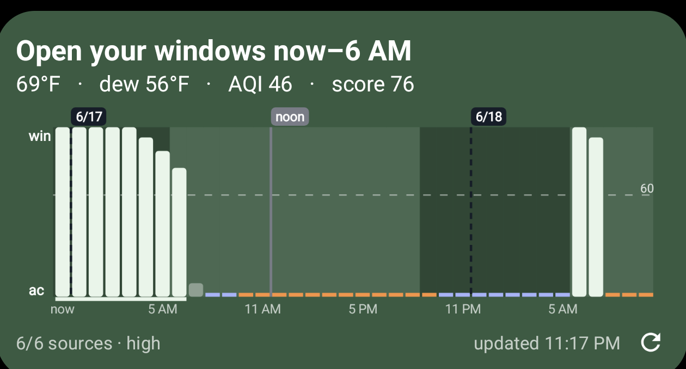
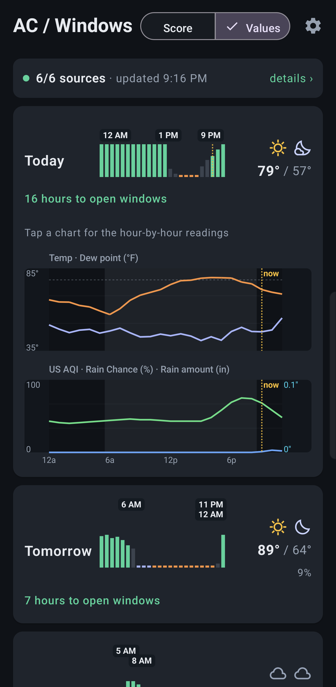
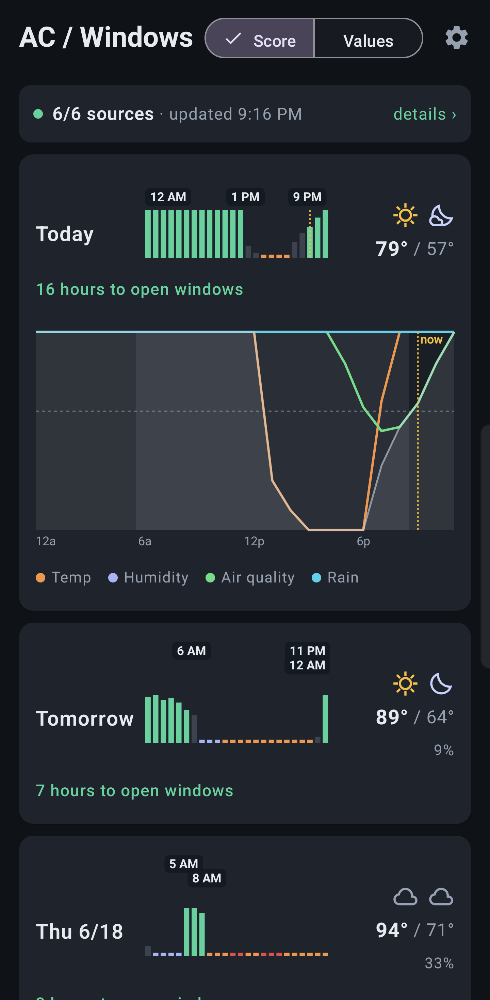

# ac_widget — open the windows, or turn on the AC?

A small, **dependency-free** Python backend that polls multiple weather sources
and tells you whether to **open your windows** (free cooling) or **run the AC**,
based on a comfort target you configure. Built so it can later drive smart-home
devices (thermostat, attic fan, automatic window openers).

This repo is the **MVP backend**: it produces the recommendation as human text
or as JSON, plus a native Android home-screen widget in
[`android/`](android/README.md) — a faithful on-device port of this engine. See
the [Roadmap](#roadmap).

```
  🪟  OPEN YOUR WINDOWS
     Cooler, comfortable, clean air outside — let it cool the house for free.
       • it's 74°F out, below your 78°F max
       • dew point 56°F is comfortable
       • AQI 30 (good)
```

## Screenshots

The Android home-screen widget — the current call, the readings behind it, and the
Open-Window Score across the next day-and-a-half (tall bars = open up, short = run
the AC; the dashed line is your open threshold):



The companion app's multi-day forecast — tap a day to expand it into either the raw
weather values or the per-factor score breakdown:

<p>
  
  
</p>

## Quick start

Requires Python 3.11+ (uses stdlib `tomllib`). No `pip install` needed —
there are **zero third-party dependencies**.

```bash
cp config.example.toml config.toml     # then edit your location & comfort target
python -m ac_widget.cli                 # human-readable
python -m ac_widget.cli --json          # machine-readable (the widget contract)
python -m ac_widget.cli --lat 40.7 --lon -74.0   # one-off location override
python -m unittest discover -s tests    # run the test suite (no network)
```

Exit code is non-zero if **no** source could be reached, so a script/widget can
detect total failure.

## How the decision is made

Opening windows is worthwhile only when the outdoor air is **cooler than you
want indoors, comfortable, clean, and dry**. The engine checks, in order:

1. **Too warm?** Outdoor temp above your `max_temp_f` → **AC** (ventilation
   can't cool below the outdoor temperature).
2. **Blocked from opening?** Even when it's cool enough, any of these keep the
   windows shut:
   - **AQI** above `aqi_max` (smoke/smog — a hard stop),
   - **precipitation** right now (don't invite rain in),
   - **dew point** above `dew_point_max_f` (muggy — opening up imports
     stickiness, so AC wins because it *dehumidifies*).
3. **Cool, clean, dry?** Below `max_temp_f − temp_margin_f` with no blockers →
   **OPEN WINDOWS**.
4. Otherwise you're near your setpoint → **comfortable**, your call.

### Why dew point (and what else I considered)

You asked whether "dew point" matters — it does, a lot. **Relative humidity is
misleading** because it moves with temperature (70% at dawn and 35% at noon can
be the *same* air). **Dew point measures absolute moisture**, so it's the honest
"how muggy will it feel" gauge:

| Dew point | Feel |
|---|---|
| ≤ 55°F | dry, pleasant |
| ~60°F | getting sticky |
| 65°F+ | oppressive |

So the engine gates window-opening on **dew point**, and treats your 40–45%
(30–50% acceptable) RH numbers as the *indoor* target they really are.

Other factors I poll or considered, and why:

- **AQI + components (PM2.5, PM10, ozone)** — the whole point of "should I open
  up"; wildfire smoke makes ventilation a bad idea even on a cool day. *(polled)*
- **Apparent / "feels-like" temperature** — surfaced for context. *(polled)*
- **Precipitation** — blocks opening windows. *(polled)*
- **Wind** — shown; light wind makes ventilation less effective. *(polled)*
- **Forecast trend** (e.g. "cooling overnight — good window-flush window" /
  "heating up — pre-cool now") — *not in the MVP* but the hourly data is already
  available from Open-Meteo; a natural next addition.
- **Indoor temperature/humidity** — the MVP assumes you simply want the house at
  or below your setpoint. A real indoor sensor (smart thermostat) would make the
  AC-vs-windows call much sharper and is part of the smart-home phase.
- **Pollen** — Open-Meteo exposes it (Europe-wide; sparse in the US); easy to add
  as another window-opening gate if you have allergies.

## Methodology — the Open-Window Score

The yes/no verdict ("open the windows" / "run the AC") answers *now*. But if
you're going to open the windows **once**, you want to know the *best* time over
the day. So the engine also produces a continuous **Open-Window Score (0–100)**
for each of the next **48 hours** and graphs it; the verdict is just that score
thresholded at **`open_score_min` (default 60)** — the dashed line on the graph —
so the two never disagree. (The widget draws as many hours as fit its width —
resizable from 2×2 to full-width — with a left axis labelled **win** (top) /
**ac** (bottom) and thin dividers at each midnight.)

### The number

The score is a **product of four factors**, each ramping linearly across a
**configurable penalty window** (an "ideal" value where it stops being perfect
and a "cutoff" value where it hits zero). It's a *product* because opening the
windows is only worth it when the air is cool **and** dry **and** clean **and**
it isn't raining — any one of those failing kills the case on its own:

```
score = 100 · f_temp · f_humid · f_aqi · f_rain
```

| Factor | 1.0 (great) when… | 0.0 (veto) when… | Why |
|---|---|---|---|
| `f_temp`  | outdoor ≤ `temp_ideal_f` | outdoor ≥ `max_temp_f` | Ventilation can't cool the house *below* the outdoor air, so above your setpoint it's useless. |
| `f_humid` | dew point ≤ `dew_point_ideal_f` | dew point ≥ `dew_point_max_f` | Dew point is the honest mugginess gauge; muggy air imported through a window is what AC *dehumidifies* away. |
| `f_aqi`   | AQI ≤ `aqi_ideal` | AQI ≥ `aqi_max` | Smoke/smog makes ventilation a bad idea even on a cool day. |
| `f_rain`  | precip prob ≤ `rain_prob_ideal` | precip prob ≥ `rain_prob_max` | Don't invite rain in. |

Both ends of every window are editable in the app (gear → settings). Each factor
is a **linear ramp between those two endpoints**, *not* a 0/1
switch. AQI is the one people ask about: with the defaults `aqi_ideal = 50`,
`aqi_max = 100`, air at **AQI ≤ 50 scores the full 1.0, AQI 75 → 0.5, AQI ≥ 100 → 0** — a smooth
de-rating, not a cliff. (The discrete *now* verdict in `decision.py` does use a
hard AQI cutoff at `aqi_max`; the Open-Window Score is the smooth version of the
same rule, so a hazy-but-not-terrible day reads as "meh," not a flat veto.)

### Why this is the right backbone (enthalpy / the "economizer" analogy)

This is not ad-hoc — it's the home-scale version of a **differential-enthalpy
economizer**, the standard control in commercial HVAC. An economizer pulls in
outside air for "free cooling" exactly when the outdoor air's **total heat
content (enthalpy)** is below the indoor air's, because moist warm air is
expensive to cool ([Telker, *Dry Bulb or Enthalpy Economizer?*][econ]). Enthalpy
combines temperature *and* humidity into one number, which is why humid climates
need it rather than a temperature-only rule. Our `f_temp · f_humid` is a
practical, interpretable stand-in for that outdoor-vs-target enthalpy comparison.

### What about sun / cloudiness?

Solar gain is a *major* driver of cooling **load** (direct sun through glass is
~100% radiant heat gain, and west-facing windows drive the afternoon peak —
[Pressbooks, *Solar Heat Gain*][solar]), but it is deliberately **not** a score
factor here:

1. **We decide about *air*, not the building.** The score compares outdoor air to
   your target. Quantifying how much the *house interior* heats up from sun needs
   your window area, orientation, and glazing (SHGC) plus an indoor sensor —
   none of which this has yet.
2. **It's partly already counted.** The hourly *temperature* forecast already
   bakes in the sun heating the outdoor air; an explicit solar term double-counts.

An earlier build folded in a small `f_solar` modifier, but it was dropped — in
practice it was a noisy proxy for temperature near the edge, not independent
signal. Sun/cloud data still powers the **advice notes**: clear nights make the
best **night-flush** window (cooling the house's thermal mass overnight can slash
AC runtime — [WindowMaster, *Night flushing*][flush]; [Givoni, *Thermal mass and
night ventilation*][mass]).

**Deferred:** precise solar-load modeling (and the indoor temperature it implies)
waits for the smart-home phase, when an indoor sensor makes it worth doing.

### Why gates, not weights (equal or otherwise)

The factors are **multiplied**, not summed with weights. That's deliberate: AQI,
rain, mugginess, and "can't cool above the outdoor temp" are each able to
**veto** on their own. A weighted/additive score would let a great temperature
*compensate* for hazardous smoke ("cool but smoky → still looks OK"), which is
exactly the wrong call. So there is no equal-vs-unequal weighting to tune for the
hard constraints — they're gates. Weighting only has meaning inside the *soft
comfort* part (how cool/dry), and that's where the models below would refine it.

### Other metrics / models considered

| Signal / model | Verdict | Why |
|---|---|---|
| **Wind speed** (polled) | annotation, not a score factor | Ventilation rate ∝ airflow, but a calm, cool night is still great to open up (stack effect + cooler air). A wind *factor* would wrongly punish it, so wind only colors the advice. |
| **Climate Cooling Potential** — degree-hours of *(reference − outdoor)* over cool hours ([Artmann et al.][ccp]) | informs the 24-h view | The night-flush literature's model: cooler and **overnight** hours carry more value (you're cooling thermal mass that pays off the next day). Extending the graph to 24 h surfaces this directly — the best window usually lands overnight. |
| **Adaptive comfort** — `T_comfort ≈ 0.31·T_running-mean + 17.8°C` ([ASHRAE 55][a55]) | proposed, opt-in | The rigorous comfort target for naturally-ventilated homes *rises* with the weekly outdoor mean (your body adapts). It would replace the fixed `max_temp_f` with a sliding band, but needs the past week's temps and changes your fixed-setpoint behavior — so it's offered, not imposed. |
| **Apparent / heat-index** (polled) | display only | It conflates temp + humidity; we keep dry-bulb + dew point separate because that maps cleanly onto the enthalpy backbone. |
| **Pollen** (Open-Meteo, EU-centric) | future gate | Easy to add as another window veto for allergy season. |

[econ]: https://www.linkedin.com/pulse/dry-bulb-enthalpy-economizer-brad-telker
[solar]: https://rvcc.pressbooks.pub/ectc102/chapter/6-7solar-heat-gain/
[flush]: https://www.windowmaster.com/expertise/natural-ventilation-and-mixed-mode-ventilation/night-flushing/
[mass]: https://www.sciencedirect.com/science/article/abs/pii/S0960148101000271
[ccp]: https://www.sciencedirect.com/science/article/abs/pii/S0306261906000766
[a55]: https://comfort.cbe.berkeley.edu/

## Data sources

We use **three** independent, free, keyless sources — all of which **forecast**
(no snapshot-only providers) — queried **in parallel** every run and
cross-checked. More sources = it keeps working when one is down or wrong:

| Provider | Cost | Coverage | Gives | Role |
|---|---|---|---|---|
| **Open-Meteo** | free, no key | global | temp, humidity, dew point, feels-like, precip, wind, cloud, **solar radiation**, **AQI** — current **and hourly** | drives the score + the hourly forecast graph (only source with hourly cloud/solar/AQI) |
| **NWS** (weather.gov) | free, no key | US only | temp, dew point, wind — real *measured* obs + hourly forecast | independent cross-check (a physical station, not a model) |
| **met.no** (Norwegian MET) | free, no key | global | temp, humidity (→ dew point), wind — current + hourly | independent third model; dew point derived via the Magnus formula |

Agreement is meaningful because the sources are independent (two different
models + a physical station): the output reports `confidence` = `high` (sources
agree), `degraded` (only one responded), or `conflict` (they differ by more than
~8°F — usually a wrong coordinate). The forecast track carries its own
agreement flag (Open-Meteo vs. NWS hourly). **If a source is down, the others
still produce a result.** (met.no's WAF occasionally 403s datacenter IPs but is
fine from home/phone networks.)

Adding a source is one file: write `fetch(location, user_agent, timeout) ->
WeatherReading` (and optionally `fetch_hourly(...)`) in `ac_widget/providers/`
and register it in `providers/__init__.py`. Good keyless candidates for a 4th:
**PirateWeather** (free key) or a second Open-Meteo *model* (e.g. `gfs_seamless`
vs `icon_seamless`) for independent model diversity through one API.

## Layout

```
ac_widget/
  config.py        # load + validate config.toml (stdlib tomllib)
  models.py        # WeatherReading, AggregateReading, Recommendation, Forecast (dataclasses)
  http_util.py     # tiny JSON-over-HTTP helper (stdlib urllib)
  providers/       # one module per source (open_meteo, nws, metno); never raises
  aggregate.py     # merge sources -> consensus + confidence
  decision.py      # PURE now-verdict engine (fully unit-tested)
  score.py         # PURE Open-Window Score (the 0-100 metric; fully unit-tested)
  forecast.py      # PURE: score the next N hours -> best window + advice notes
  cli.py           # fetch -> aggregate -> decide -> score -> print (human or --json)
tests/             # stdlib unittest, no network
config.example.toml
```

The seam for smart-home control is deliberate: `decision.py` is pure and emits an
`action` (`OPEN_WINDOWS` / `RUN_AC` / `KEEP_CLOSED` / `COMFORTABLE`). A future
controller maps those actions to devices without touching the decision logic.

## Roadmap

- [x] **MVP backend** — multi-source fetch, comfort decision, CLI + JSON.
- [x] **Phone widget** — native Kotlin home-screen widget in
      [`android/`](android/README.md) (a faithful on-device port of this engine).
      **Compiles** (`./gradlew assembleDebug`) and runs in a local KVM emulator or on a real
      phone over USB; build + emulate from the CLI with `android/dev.sh` (no Android Studio).
- [x] **Forecast-aware advice** — multi-hour Open-Window Score graph, best-window
      detection, and night-flush / pre-cool notes (`score.py` + `forecast.py`;
      the widget draws the graph and caches results with a 15-min TTL).
- [ ] **Indoor sensor input** — use the smart thermostat's actual indoor temp/RH
      (also unlocks proper solar-load modeling — see *Methodology*).
- [ ] **Smart-home control** — map actions to thermostat / attic fan / window
      openers (likely via Home Assistant or direct device APIs).

## Security notes

This follows a proportionate, personal-project security posture:

- **Keyless by default** — all three default sources (Open-Meteo, NWS, met.no)
  need no API key, so the core path has no secrets to leak. The Android app can
  *optionally* add keyed hyperlocal sources; those keys are pasted into the app
  and stored only on the device (a private `0600` file), never in the repo.
- **`config.toml` is gitignored** — your coordinates pinpoint your home, so the
  real file stays untracked; only `config.example.toml` (placeholder coords) ships.
- **Zero third-party dependencies in the Python backend** — nothing to typosquat
  or supply-chain. (The Android app pins its AndroidX/Compose versions via the BOM.)
- **Network use is explicit and minimal** — only the weather hosts above are
  contacted; no telemetry, no analytics, no data sent anywhere else.

## License

ac_widget is free software, licensed under the **GNU General Public License v3.0**
— see [LICENSE](LICENSE). You may use, study, share, and modify it; derivative
works must remain open-source under the same license.

The bundled weather glyphs are Google's **Material Symbols** (Apache-2.0), noted
in `android/.../Weather.kt`.
